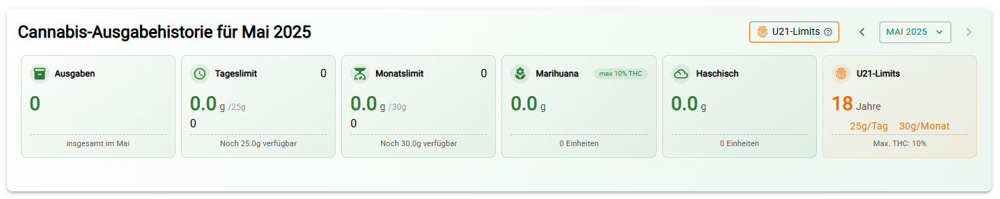
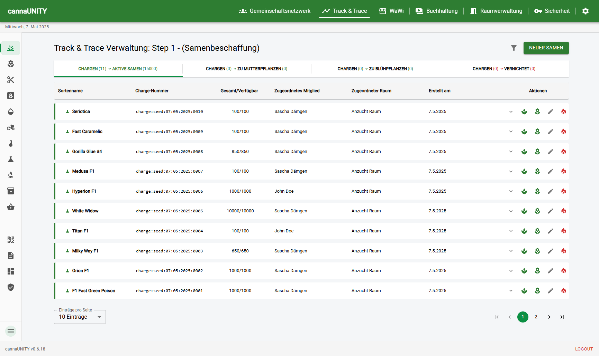
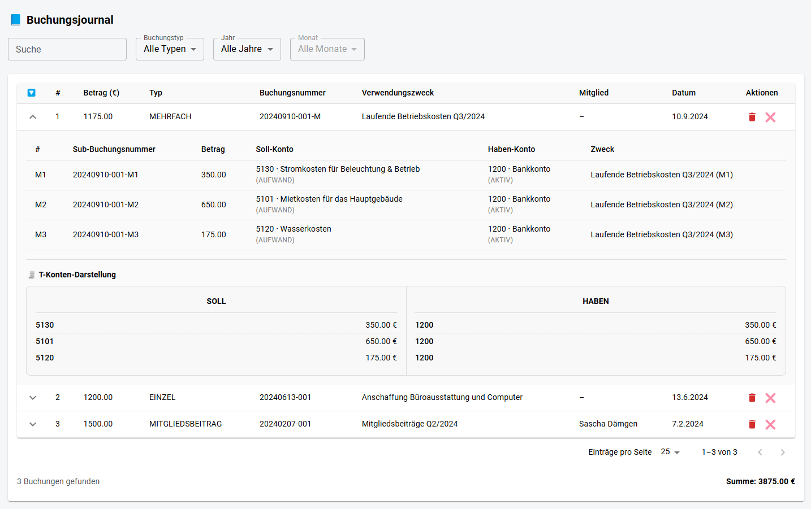
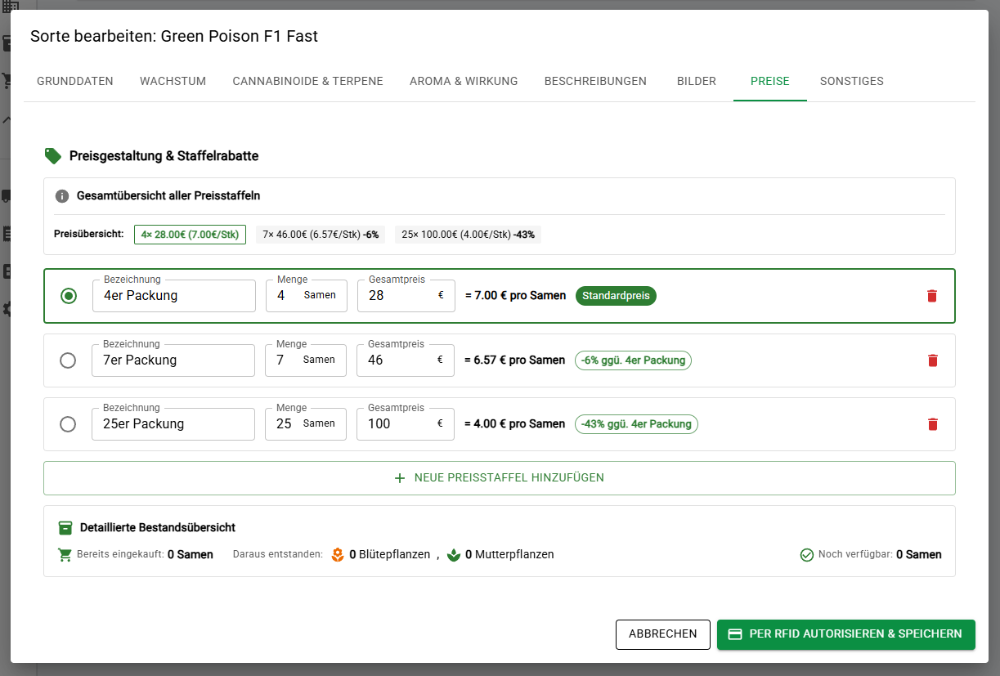

# 🌿 cannaUNITY v0.6.20 (Pre-Alpha)
(Masteransicht für "festes" UI Panel 1920x1080p)

<p align="center">
  
</p>

> **Modulare Open-Source-Software Suite für Cannabis Social Clubs und Anbauvereinigungen gemäß dem Konsumcannabisgesetz § (KCanG)**

> Mitgliederverwaltung · eVereinsverwaltung · Berichtsverwaltung · Aufgabenplanung ·  Growcontroller · Zutrittskontrolle · eStempelkarte · Track & Trace · Buchhaltung · WaWi · Raumautomation · Sicherheitssystem


---

## 📦 Was ist cannaUNITY?

**cannaUNITY** ist eine professionelle Open-Source-Plattform zur Organisation, Verwaltung und Automatisierung von Cannabis-Anbauvereinigungen gemäß dem Konsumcannabisgesetz (KCanG). Das System wird mit dem Ziel entwickelt, Sicherheit, Datenschutz (DSGVO), Nachverfolgbarkeit und Mitwirkung der Mitglieder auf "höchstem" technischen Niveau umzusetzen.

"Crescit sub pondere virtus." – "Tugend wächst unter Belastung."

---

## 🧪 Features

- ✅ Echtzeit UUID-Track & Trace von Pflanzen, Verarbeitung & Produktausgabe
- ✅ Erzeugung von Batch und Chargenummern inkl. 128 Bit UUID Anbindung
- ✅ Digitalisierte Produktausgabe mit Limitkontrolle
- ✅ RFID/NFC Arbeitszeiterfassung mit Minijob/Pflichtstunden & Ehrenamt Erkennung
- ✅ Automatische KI Personenerkennung per UniFi Protect AI Key API / Webhook Anbindung
- ✅ Dynamische Mitgliederprofile mit UUID RFID Ausweisen inkl. Evolis Kartendruckeranbindung
- ✅ SIMATIC S7 1200 G2 Integration mit API-gesteuerter Licht-, Klima- und Prozessautomation
- ✅ Vollständig redundante Raumsteuerungen mit Zentraler UI Anbindung & Alarmserver
- ✅ Native API Unterstützung für UniFi (Ubiquiti) Access, Protect, AI Key und Network
- ✅ Raumautomation (Loxone, Honeywell)
- ✅ Growcontroller mit Anbindung für WYSIWYG Raum Designer
- ✅ Laborberichtsverwaltung inkl. HPLC & GC (CSV Import)
- ✅ Vollständige Protokollierung für Behördenzugriff
- ✅ Touchpanelsteuerung & Custom UI Panels für Raumanzeige
- ✅ Anonymisierte Produktausgabe mit UUID Verknüpfung über ZKP (Online)
- ✅ Warenwirtschaftssystem (WaWi) mit Anbindung an Track & Trace / Buchhaltung  
- ✅ GMP konforme Laborberichte erstellen,verwalten & speichern.
- ✅ GoB-konforme Buchhaltung mit vollständiger Journaldarstellung
- ✅ Stornobuchungen mit gegenbuchender Rückabwicklung (SOLL/HABEN)
- ✅ Einzel- und Mehrfachbuchungen inkl. Subtransaktionen & Kontenwahl
- ✅ Vollständige Verknüpfung zu Mitgliedskonten & Mitgliedsbeiträgen
- ✅ Filterbare Journalansicht nach Jahr, Monat, Typ & Stornostatus

<p align="center">
  
</p>

---

## 🧠 Architekturüberblick

- **Backend:** Django 5.x (API-only), Django REST Framework, PostgreSQL (P) / SQLite (E)
- **Frontend:** React + Vite + Material UI (SPA)
- **Schnittstellen:** UniFi Access/Protect (native), Joomla 5, Siemens SIMATIC S7 1200 G2, Loxone Mini Server, Agilent 1260 Infinity HPLC, TSC TC200, Evolis Primacy, MQTTS, REST, 
- **Technologien:** TokenAuth, WebSocket, Axios, passkey-auth, Container-kompatibel

---

## 🛡️ § KCanG konform, Datenschutz & Anonymisierungskonzept

**cannaUNITY** basiert vollständig auf dem Zero-Knowledge-Prinzip:  
Es findet eine strikte Trennung zwischen personenbezogenen Daten (lokal) und anonymisierten Online-Daten (UUID-basiert) statt. Der Onlinebereich erhält **niemals** Zugriff auf echte Identitäten oder/und personenbezogene Daten!

### Authentifizierung & Zugriffskontrolle

- **Online-Login:** Joomla/Passkey (biometrisch), alternativ 3-Faktor mit PIN  
- **Zutritt zur Anlage (Außenbereiche):** UniFi Access mit RFID, Gesichtserkennung, optional PIN  
- **Innenbereiche (z. B. Blütekammer):** Zugang ausschließlich per NFC/RFID, automatische Arbeitszeiterfassung  
- **Produktionsschritte:** Track&Trace-Eingaben erfolgen über RFID/NFC-Terminals mit Rollenbindung

---

## 🔁 Track & Trace: Vom Samen bis zur Ausgabe

<p align="center">
  
</p>

Jeder Verarbeitungsschritt ist dokumentiert und manipulationssicher protokolliert:

1. **Einkauf** des Samens
2. **Einpflanzung** – entweder zur Mutterpflanze oder direkt zur Blühpflanze
3. **Stecklingsbehandlung**
4. **Wuchsbetreuung**
5. **Ernte**
6. **Trocknung**
7. **Laborkontrolle**
8. **Verarbeitung**
9. **Produktausgabe** an Mitglieder (anonymisiert)
10. **Vernichtung** (optional, wenn nötig)

Jeder Schritt wird über die Mitarbeiterkonten per RFID/NFC bestätigt und in Echtzeit dokumentiert.

---

## 🔧 Integration & Automatisierung

<p align="center">
  
</p>

cannaUNITY setzt ab sofort vollständig auf die neueste Generation der Siemens SIMATIC S7-1200 G2 Steuerungstechnik. Die zuvor integrierte Siemens LOGO8!-Anbindung wurde aufgrund ihrer konzeptionellen Limitierungen entfernt. Die LOGO-Serie bot keine strukturierte API, keine fernkonfigurierbaren Zeitschaltlogiken und war für den mehrraumfähigen Growcontroller-Betrieb weder skalierbar noch wartbar.

Die SIMATIC G2 hingegen ermöglicht erstmals die vollständige Steuerung industrieller Prozesse über eine moderne Webarchitektur mit echter API-Kommunikation – sicher, performant, redundant und vollständig integrierbar in das cannaUNITY-Frontend.

🔌 Highlights der SIMATIC G2 Integration
✅ Web-API mit strukturierter REST-Kommunikation (HTTPS, JSON)
✅ MQTT-Anbindung mit Topic-Flexibilität über LMQTT_FB
✅ TLS-Verschlüsselung, Multisession, Authentifizierung
✅ Zeitschalt-, Rampen- und Szenensteuerung über Django konfigurierbar
✅ UUID-basierte Verknüpfung jeder SPS zu einem Raumobjekt
✅ Redundanter Autonomiebetrieb: Räume funktionieren auch ohne Zentrale

🌞 0–10 V Lichtsteuerung & Tageslichtprofile
Über das SM1232-AQ Analogausgangsmodul steuert cannaUNITY sämtliche 0–10 V LED-Growlampen energieeffizient und dynamisch – direkt aus dem zentralen UI. Die Lichtprofile beinhalten Sonnenaufgangs- und Sonnenuntergangssimulationen mit fein abgestufter Dimmung bis auf exakt 0 %, was viele andere Systeme technisch nicht unterstützen.

Die Lichtsteuerung erfolgt über benutzerfreundliche Zeitraster mit Rampenfunktionen, die in der cannaUNITY-Oberfläche konfiguriert und per API an die SPS übertragen werden. Jeder Raum agiert dabei unabhängig und besitzt eine eigene SPS – vollständig synchronisiert, aber autark funktionsfähig.

Mit dieser Architektur bringt cannaUNITY industrielle SPS-Technik erstmals in eine visuell steuerbare Webumgebung für Grower – ohne SPS-Kenntnisse, ohne STEP7, ohne klassische Programmierung. Die Steuerung erfolgt vollständig über ein interaktives UI, das nicht nur Licht, sondern auch Klima, Bewässerung, Trocknung und Prozesszyklen in Echtzeit erfasst und ansprechbar macht.

---

## 📘 Buchhaltungssystem: GoB-konforme, modulare Finanzübersicht

<p align="center">
  
</p>

Das integrierte Buchhaltungssystem ist vollständig GoB-konform aufgebaut und erlaubt eine transparente, strukturierte Abbildung aller finanziellen Vorgänge im Verein.
Es wurde speziell für Anbauvereinigungen entwickelt und verbindet klassische Buchhaltungsprinzipien mit moderner, filterbarer Darstellung im Webinterface.

Unterstützte Funktionen & Module:
1. Hauptbuch – T-Konten-Übersicht mit SOLL-/HABEN-Salden und Journalanzeige
2. Gewinn- und Verlustrechnung (GuV) – gruppierte Darstellung nach Kostenarten
3. Bilanz – Stichtagsbezogene Bilanz mit Prüfung der Bilanzgleichheit
4. Mitgliederverknüpfung – automatische Verbindung von Buchungen zu Mitgliedsbeiträgen
5. Storno-Logik – rückwirkende Stornierung mit Gegenbuchung & Filteroptionen
6. Mehrfachbuchungen – Subtransaktionen mit durchgehender Buchungsnummerierung
7. Filterfunktionen – nach Jahr, Monat, Buchungstyp, Stornostatus und Zweck
8. Schnittstellenvorbereitung – DATEV, CSV, PDF-Export geplant
9. Zukunftssicher – Unterstützung für Jahresabschluss, EÜR/Umschaltung, Saldenübernahme
10. Warenwirtschaftssystem mit Anbindung an Track and Trace + Buchhaltung

Jede Buchung wird revisionssicher gespeichert, über das Journal vollständig einsehbar gemacht und kann in Echtzeit ausgewertet werden.
Die Umsetzung folgt den Grundsätzen ordnungsgemäßer Buchführung (GoB) und bildet die Basis für steuerlich relevante Auswertungen.

---

## 🌿 Warenwirtschaftssystem: Integrierte Cannabis-Genetikverwaltung mit Track & Trace

<p align="center">
  
</p>

Das Warenwirtschaftssystem bildet das Herzstück der Cannabis-Verwaltung und verbindet nahtlos Genetik-Stammdaten mit operativer Bestandsführung.
Durch die bidirektionale Integration mit Track & Trace und Buchhaltung entsteht ein geschlossener Kreislauf vom Sameneinkauf bis zur Ernte.
Unterstützte Funktionen & Module:

1. Genetik-Datenbank – Über 40 Attribute pro Strain (THC/CBD, Terpene, Wachstum)
2. Preisstaffel-System – Flexible Mengenrabatte mit automatischer Kalkulation
3. Track & Trace Integration – Live-Bestandsanzeige aus operativen Daten
4. Buchhaltungs-Workflow – Bestellanforderung → Freigabe → Buchung
5. RFID-Autorisierung über UniFi Access – Manipulationssichere Dokumentation aller Aktionen
6. Medien-Verwaltung – Multi-Image Support mit Metadaten & Drag & Drop
7. Einkaufs-Aggregation – Chargenübergreifende Bestandsermittlung
8. Audit-Trail – Lückenlose Änderungshistorie für Compliance
9. API-Schnittstellen – REST-basierte Kommunikation zwischen Systemen
10. Echtzeit-Metriken – Verfügbare Samen, Pflanzenkonvertierungen, Verluste

```
Track&Trace DB → Django ORM → API Endpoint → React Component → UI Update
     ↑                                              ↓
     └──────────── User Actions ←───────────────────┘
```

Jede Bestellung durchläuft automatisch den Freigabeprozess der Buchhaltung, wird im Track & Trace als Wareneingang erfasst und aktualisiert sofort die Bestandsübersicht im Warenwirtschaftssystem.
Die Lösung erfüllt alle regulatorischen Anforderungen des Konsumcannabisgesetzes (KCanG) und ermöglicht eine revisionssichere Dokumentation der gesamten Supply Chain.

---

## 🐳 Bereitstellung & Infrastruktur

Geplant sind:

- Eigene **Docker-Images** mit Standardkonfiguration
- **Proxmox-kompatible Images** für einfache VM-Einbindung
- Eigene **Linux-Distribution (cannaOS)** für speziell konfigurierte Mini-PCs
- (Kostenplichtig) Vorkonfigurierte Endkunden Lösungen.
- (Kostenplichtig) Vollständige Hardware Sets zum Kauf/Miete. 

---

## 📂 Projektstruktur (Auszug)

```
cannaUNITY/
├── backend/
│   ├── config/            # Django-Einstellungen
│   ├── members/           # Mitgliederverwaltung
│   ├── rooms/             # Räume & Sensorik
│   └── static/frontend/   # Build der React-App
├── frontend/
│   ├── src/
│   │   ├── apps/          # React-Apps pro Django-Modul
│   │   ├── layout/        # Topbar, Sidebar, Footer
│   │   └── main.jsx
```

---

## 🔐 Authentifizierungskonzept

- Tokenbasierte API-Auth (Token wird im `localStorage` gespeichert)
- Passkey-Login mit 2-/3-Faktor-Authentifizierung
- Zutritt zur Anlage & Innenräumen über UniFi / RFID / NFC
- Online-Zugriff strikt anonymisiert über UUID/Passkey
- Track and Trace Schritt Freigabe/Identifikation über RFID / NFC

---

## 🚀 Module (Auszug)

| Modul            | Beschreibung                                                                 |
|------------------|------------------------------------------------------------------------------|
| `members`        | Mitglieder, Limits, Pflichtstunden, Statusverwaltung                         |
| `trackandtrace`  | Verarbeitungsschritte (Seed → Bloom → Ausgabe) inkl. Vernichtungen           |
| `access`         | UniFi Access: RFID, FaceID, Logs, Zutrittsrechte                             |
| `rooms`          | Raumverwaltung mit Klima, Sensoren & Automation                              |
| `taskmanager`    | Aufgabenreservierung, Stundenkonto, Abgleiche                                |
| `buchhaltung`    | GoB-konforme Buchhaltung mit HBCI Abgleich,                                  |
| `interface`      | Touchpanels, Raumterminals, Infodisplays                                     |
| `controller`     | Anbindung Siemens/Loxone,                         |
| `security`       | Alarmsysteme, Notfallzugänge, Behördenzugriff                                |
| `ha`             | Home Assistant Integration                                                   |

---

## 🧱 Betrieb in der Produktion – Sicherheitskonzept

Dieser Abschnitt beschreibt empfohlene Maßnahmen zur Absicherung des cannaUNITY-Systems beim Einsatz auf einem öffentlichen Server oder im produktiven Umfeld.

### 🔒 1. Sicherheit auf Rootserver & Betriebssystemebene (Linux)

**System-Härtung**
- SSH-Zugriff ausschließlich mit Public-Key
- Root-Login deaktivieren
- Firewall (z. B. `ufw`) mit Whitelist für Web & SSH
- Fail2Ban zum Schutz vor Brute-Force-Angriffen

**Reverse Proxy**
- Einsatz von **NGINX** oder **Traefik** vor Django/React
- HTTPS via **Let's Encrypt / Certbot**
- CORS, HSTS, CSP-Header definieren

**Automatische Updates / Patch-Management**
- `unattended-upgrades` oder zentrale Ansible-Skripte
- Überwachung auf bekannte CVEs für Abhängigkeiten

**Deployment & User Isolation**
- Trennung von Systemusern für Dienste (z. B. `cannaunity-web`, `cannaunity-db`)
- Nutzung von `systemd`-Services mit `PrivateTmp`, `ProtectSystem=strict`

### ⚙️ 2. Django: Sicherheit & Absicherung der API

- `DEBUG = False` und `ALLOWED_HOSTS` korrekt gesetzt
- `SECRET_KEY` sicher gespeichert (z. B. in `.env` oder Vault)
- Nutzung von **HTTPOnly- & Secure-Cookies** für Authentifizierungs-Token
- Aktivierung von **CSRF-Schutz**, besonders bei API POST-Endpunkten
- `SECURE_BROWSER_XSS_FILTER = True`, `SECURE_CONTENT_TYPE_NOSNIFF = True`
- **Logging & Audit-Logs** für API-Zugriffe (z. B. mit `django-auditlog`)

### 🎨 3. React/Vite: Sicherheit im Frontend

- Kein Zugriff auf `.env`-Variablen mit sensiblen Inhalten im Frontend
- Build-Version mit `vite build` erzeugen, Hashes aktiv
- Public-Folder prüfen auf unerwünschte Dateien
- Schutz vor XSS über kontrollierte Komponenten & `dangerouslySetInnerHTML` vermeiden
- CSP-Header über NGINX erzwingen

### 🧊 4. Datenbanksicherheit (PostgreSQL + Verschlüsselung)

- **Festplattenverschlüsselung** auf Betriebssystemebene (`LUKS`, `dm-crypt`)
- **SSL/TLS aktivieren** in PostgreSQL (`ssl = on`, Zertifikate einrichten)
- **Rollenbasierte Zugriffssteuerung** (kein Public Access, least privilege)
- Einsatz von `pgcrypto` für spaltenbasierte Verschlüsselung sensibler Felder:

  ```sql
  SELECT pgp_sym_encrypt('0123 456789', 'my_secret_key');
  ```

- **Key Management** über HashiCorp Vault, Azure Key Vault oder eigene Lösung
- Zugriffsprotokollierung & Audit-Tools wie [`pgAudit`](https://www.pgaudit.org/)

### 💡 Zusätzliche Empfehlungen

- **Backups** regelmäßig & verschlüsselt (z. B. `borg`, `restic`)
- **Monitoring & Alerting** (z. B. UptimeRobot, Netdata, Prometheus/Grafana)
- **Zero-Trust-Netzwerkprinzip** (VPN, IP-Whitelisting, kein offenes Netz)
- **Security-Review aller Django-Endpoints** vor Deployment

> Hinweis: Diese Empfehlungen sind bewusst auf ein produktives Setup auf eigenem Rootserver abgestimmt. Für Cloud-Deployments (AWS, Azure, etc.) gelten abweichende Best Practices – inklusive VPC-Isolierung und IAM-Kontrollstrukturen.

---

## 📃 Lizenz & Hinweis zur Nutzung

**cannaUNITY** ist ein freies Open-Source-Projekt unter der MIT-Lizenz. Die aktuelle Version v0.6.20 (Pre-Alpha) dient ausschließlich der Mitentwicklung, dem Testen und der Konzeptvalidierung. Eine produktive Nutzung ist derzeit nicht vorgesehen. Die Software wird ohne Gewährleistung bereitgestellt. Die Nutzung erfolgt auf eigenes Risiko. Eine Haftung für Schäden oder Datenverluste wird ausgeschlossen!
