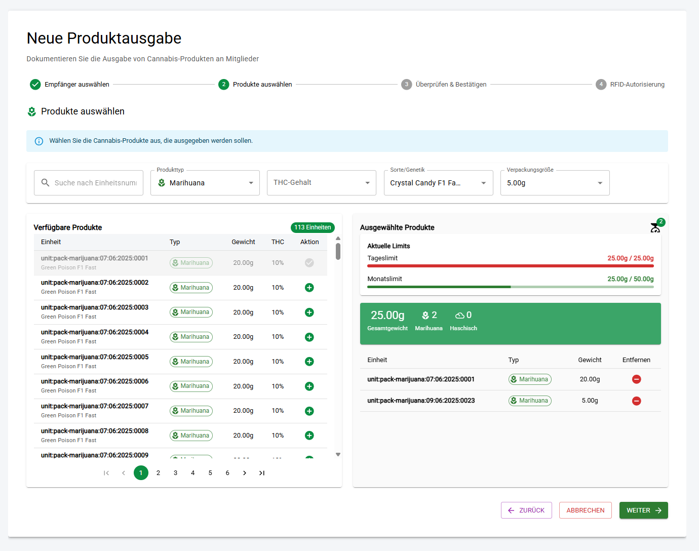
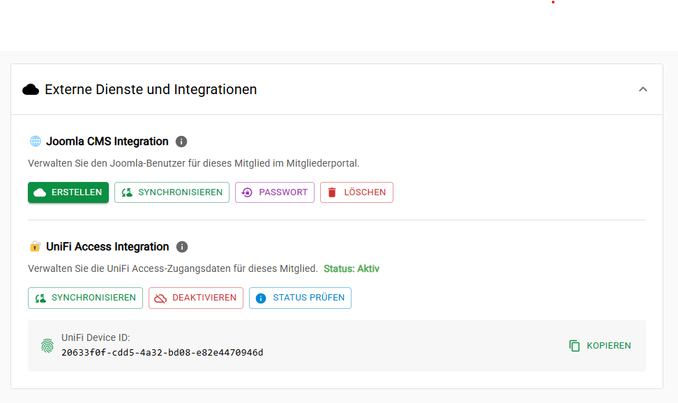
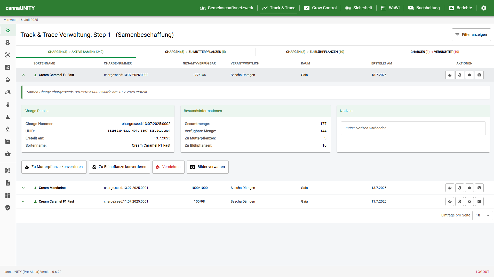
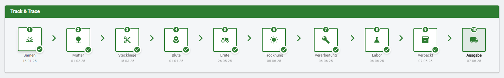
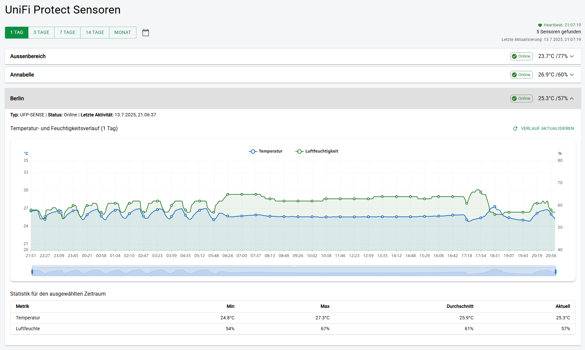
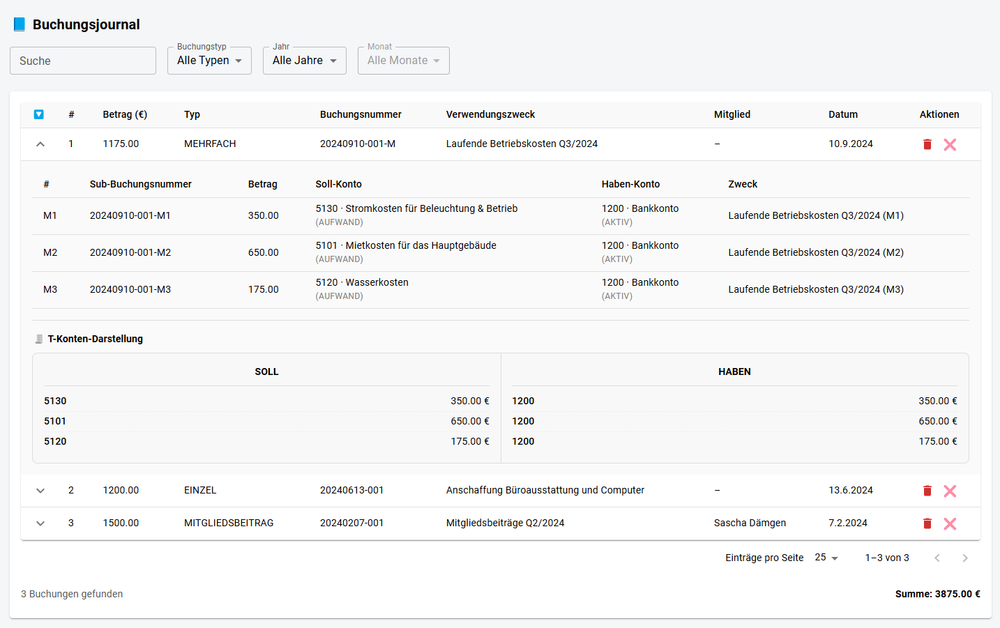
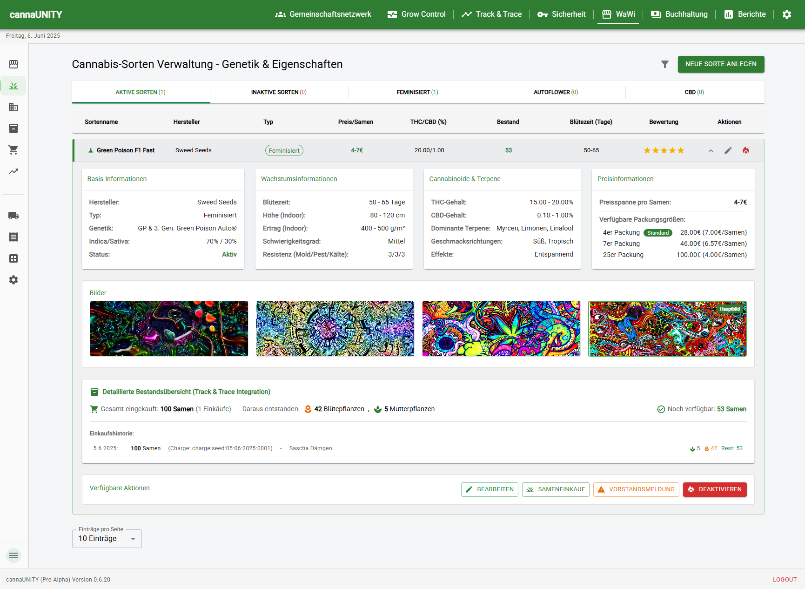

# 🌿 cannaUNITY v0.6.18 (Pre-Alpha Testfork by cannatoshi)
"Masteransicht für festes UI Panel 1920x1080p"

> **Modulare Open-Source-Software für Cannabis Social Clubs und Anbauvereinigungen gemäß dem Konsumcannabisgesetz § (KCanG)**  
> Mitgliederverwaltung · Aufgabenplanung · Zutrittskontrolle · Track & Trace · Buchhaltung · WaWi · Raumautomation · Sicherheitssysteme


> **Modulares Open-Source-Software Framework für Cannabis Social Clubs und Anbauvereinigungen gemäß dem deutschem Konsumcannabisgesetz § (KCanG)**
> Mitgliederverwaltung · eVereinsverwaltung · Berichtsverwaltung · Aufgabenplanung ·  Growcontroller · Zutrittskontrolle · eStempelkarte · Track & Trace · Buchhaltung · WaWi · Raumautomation · Sicherheitssystem · IOS & Android APP · Verwaltungs, Administrations und User UI`s,

(Masteransicht für "festes" UI Panel 1920x1080p)

<p align="center">
  
</p>

---

## 📦 Was ist cannaUNITY?

**cannaUNITY** ist ein professionelles Open-Source-Framework zur Organisation, Verwaltung und Automatisierung von Cannabis-Anbauvereinigungen gemäß Konsumcannabisgesetz (KCanG).

> **Hinweis:**  
> Dieses Repository enthält das **Framework** als technischen Baukasten und ist nicht als sofort lauffähiges Komplettsystem vorgesehen. Für die produktive Nutzung muss das Framework von Entwickler:innen in bestehende oder neue Systemlandschaften integriert werden.

---

## 🧩 Konzept und Zielsetzung

cannaUNITY stellt sämtliche Bausteine und Schnittstellen bereit, um die gesetzlichen und organisatorischen Anforderungen moderner Cannabis-Anbauvereinigungen digital, automatisiert und transparent abzubilden.  
Kernpunkte sind u.a.:

- **Zugangskontrolle** (UniFi Access, alters-/THC-gerecht)
- **KI-gestützte, DSGVO-konforme Protokollierung** (UniFi Protect)
- **Automatisierte Anlagensteuerung** (SIMATIC S7 Integration)
- **Warenwirtschaft und Buchhaltung** (GoB-konform, prozessbasiert)

> **ℹ️ Zielgruppe:**  
> - Entwickler:innen und Tech-Teams, die individuelle oder erweiterbare Lösungen aufsetzen möchten  
> - Integratoren und Dienstleister, die Vereine technisch unterstützen  
> - Vereine mit eigenem IT-Know-how

---

## 🚧 Aktueller Status

- Dieses Repository bildet das **Open-Source-Framework** ab und richtet sich vor allem an Entwickler:innen und technische Teams.
- Eine kostenpflichtige **Professional-Version** (einsatzfertige Komplettlösung, inkl. Konfigurations- und Installationspaketen) befindet sich in Planung.
- Zusätzlich werden zukünftig **passende Hardware-Komponenten** (Miete oder Kauf im Paket) angeboten, um eine nahtlose End-to-End-Lösung zu ermöglichen.

> **⚠️ Wichtig:**  
> Das Framework alleine ist nicht als Plug-and-Play-Lösung gedacht!  
> Eine spätere produktive Nutzung erfordert Integration und ggf. Anpassung an die jeweilige Systemumgebung.

---

## 💡 Highlights

- **Modulares, modernes, erweiterbares Framework**
- **Rechtssicherheit** (Transparenz, Nachvollziehbarkeit, Datenschutz)
- **Automatisierung** aller operativen und dokumentationspflichtigen Prozesse
- **Flexible Hardware-Integration**
- **10 Schritte UUID Track & Trace**
- **GoB-konforme Buchhaltung und Warenwirtschaft**
- **Zukunftssicher**: Roadmap zur Professional-Version mit Hardware-Bundles

---

## 📈 Roadmap

- [ ] Framework-Release als Open Source Final v1.xx
- [ ] Entwicklung der Professional-Version (einsatzfertige Komplettlösung)
- [ ] Erweiterung um offizielle Hardware-Angebote (Miete/Kauf)
- [ ] Unterstützung weiterer Schnittstellen und Technologien

---

**cannaUNITY** steht für ein Höchstmaß an Transparenz, Sicherheit und technischer Zukunftsfähigkeit in Cannabis-Anbauvereinen – heute als Framework, morgen als vollintegrierte Komplettlösung.
"Crescit sub pondere virtus." – "Tugend wächst unter Belastung."

---

## 🧪 Features

- ✅ Echtzeit UUID-Track & Trace von Pflanzen, Verarbeitung & Produktausgabe
- ✅ Erzeugung von Batch und Chargenummern inkl. 128 Bit UUID Anbindung
- ✅ Native Android, IOS & Windows APP
- ✅ Matrix 2.0 Protocol Integration + Element X Intregration
- ✅ WordPress oder Joomla CMS Online Anbindung über ZKP/SSH Tunnel
- ✅ Digitalisierte Produktausgabe mit Limitkontrolle
- ✅ Verschlüsselte Mitgliederkommunikation - Ende-zu-Ende verschlüsselte Gruppen-Chats
- ✅ RFID/NFC Arbeitszeiterfassung mit Minijob/Pflichtstunden & Ehrenamt Erkennung
- ✅ Automatische KI Personenerkennung per UniFi Protect AI Key API / Webhook Anbindung
- ✅ Dynamische Mitgliederprofile mit UUID RFID Ausweisen inkl. Evolis Kartendruckeranbindung
- ✅ SIMATIC S7 1200 G2 Integration mit API-gesteuerter Licht-, Klima- und Prozessautomation
- ✅ Vollständig redundante Raumsteuerungen mit Zentraler UI Anbindung & Alarmserver
- ✅ Native API Unterstützung für UniFi (Ubiquiti) Access, Protect, AI Key und Network
- ✅ Raumautomation (Loxone, Honeywell)
- ✅ Growcontroller mit Anbindung für WYSIWYG Raum Designer
- ✅ Laborberichtsverwaltung inkl. HPLC & GC (CSV Import)
- ✅ Vollständige Protokollierung für Behördenzugriff
- ✅ Touchpanelsteuerung & Custom UI Panels für Raumanzeige
- ✅ Anonymisierte Produktausgabe mit UUID Verknüpfung über ZKP (Online)
- ✅ Warenwirtschaftssystem (WaWi) mit Anbindung an Track & Trace / Buchhaltung  
- ✅ GMP konforme Laborberichte erstellen,verwalten & speichern.
- ✅ GoB-konforme Buchhaltung mit vollständiger Journaldarstellung
- ✅ Stornobuchungen mit gegenbuchender Rückabwicklung (SOLL/HABEN)
- ✅ Einzel- und Mehrfachbuchungen inkl. Subtransaktionen & Kontenwahl
- ✅ Vollständige Verknüpfung zu Mitgliedskonten & Mitgliedsbeiträgen
- ✅ Filterbare Journalansicht nach Jahr, Monat, Typ & Stornostatus
- ✅ Multi-Chain ForeignKey Track&Trace: Lückenlose Rückverfolgung aller Produkte („Chain-of-Custody“) per ForeignKey

---

<p align="center">
  
</p>

---

## 🧠 Architekturüberblick

- **Backend:** Django 5.x (API-only), Django REST Framework, PostgreSQL (P) / SQLite (E)
- **Frontend:** React + Vite + Material UI (SPA)
- **Datenmodell:** Multi-Chain ForeignKey-Verknüpfung aller Track&Trace-Objekte (von der Verpackungseinheit bis zur Ur-Saat oder Mutterpflanze), mit dynamischer UI-Filterung und garantiert konsistenter Herkunftskette. Einzigartige Flexibilität, maximale Nachvollziehbarkeit.
- **Schnittstellen:** UniFi Access/Protect (native), Wordpress, Joomla, Siemens SIMATIC S7 1200 G2, Loxone Mini Server, Agilent 1260 Infinity HPLC, TSC TC200, Evolis Primacy, MQTTS, REST, 
- **Technologien:** TokenAuth, Matrix 2.0, WebSocket, Axios, passkey-auth, Container-kompatibel

```
flowchart LR
    PU[Verpackungseinheit] --> PVB[Verarbeitungschargen]
    PVB --> DRY[Trocknung]
    DRY --> HRV[Ernte]
    HRV --> BLF[Blühpflanze]
    BLF --> SEED[SeedPurchase/Mutterpflanze]
    SEED --> STR[Genetik / Strain]
```

---

<p align="center">
  
</p>

---

## 🛡️ § KCanG konform, Datenschutz & Anonymisierungskonzept

**cannaUNITY** basiert vollständig auf dem Zero-Knowledge-Prinzip:  
Es findet eine strikte Trennung zwischen personenbezogenen Daten (lokal) und anonymisierten Online-Daten (UUID-basiert) statt. Der Onlinebereich erhält **niemals** Zugriff auf echte Identitäten oder/und personenbezogene Daten!

### Authentifizierung & Zugriffskontrolle

```
[Lokal: Root-Server]                              [Online-Server]
 ┌──────────────────────────┐                     ┌────────────────────────────┐
 │ Django Backend           │                     │ Sync-Datenbank/API         │
 │ Lokale PostgreSQL DB     │                     │ Login/API für Mobile App   │
 │ Interne UI (Admin, Web)  │                     │                            │
 └────────────┬─────────────┘                     └────────────┬──────────────┘
              │    🔄 Pull/Push per API                  🔄 Pull durch App
              ▼                                           ▼
     → Einweg-Kommunikation:                   [React Native App (z. B. iOS)]
     Lokaler Cronjob sendet Daten →            Zugriff **nur auf Online-API**

Optional > Push Gateway: Lokaler Server → Mini-API auf VPS → schiebt Daten an App-API
```

- **Online-Login:** Joomla/Passkey (biometrisch), alternativ 3-Faktor mit PIN  
- **Zutritt zur Anlage (Außenbereiche):** UniFi Access mit RFID, Gesichtserkennung, optional PIN  
- **Innenbereiche (z. B. Blütekammer):** Zugang ausschließlich per NFC/RFID, automatische Arbeitszeiterfassung  
- **Produktionsschritte:** Track&Trace-Eingaben erfolgen über RFID/NFC-Terminals mit Rollenbindung

---

## 🔁 UUID Track & Trace: Vom Samen bis zur Ausgabe inkl. MMS

<p align="center">
  
</p>

Jeder Verarbeitungsschritt ist dokumentiert und manipulationssicher protokolliert:

1. **Einkauf** des Samens
2. **Einpflanzung** – entweder zur Mutterpflanze oder direkt zur Blühpflanze
3. **Stecklingsbehandlung**
4. **Wuchsbetreuung**
5. **Ernte**
6. **Trocknung**
7. **Laborkontrolle**
8. **Verarbeitung**
9. **Produktausgabe** an Mitglieder (anonymisiert)
10. **Vernichtung** (optional, wenn nötig)

Jeder Schritt wird über die Mitarbeiterkonten per RFID/NFC bestätigt und in Echtzeit dokumentiert.

- 🚦 **Einzigartig bei cannaUNITY:**  
> Dank Multi-Chain ForeignKey-Architektur werden sämtliche Verarbeitungswege (Samen, Stecklinge, Mischkulturen) vollständig lückenlos abgebildet – von der Verpackungseinheit bis zum Ursprung der Genetik.  
> Jede Verarbeitungskette bleibt auch nach Migration, Umbenennung oder Anpassung nachvollziehbar und referenziert immer auf die echten Objekte – keine Redundanzen, keine „Schattenfelder“, keine Datenverluste.

<p align="center">
  
</p>

Multimedia-Support im Track&Trace-Modul

Das Track & Trace-System unterstützt ab sofort die Upload- und Zuordnung von Multimedia-Dateien (Bilder und Videos) zu den jeweiligen Arbeitsschritten einzelner Chargen. Die Implementierung ist derzeit für die Schritte 1 bis 5 produktiv freigeschaltet:

✅ Schritt 1: Sameneinkauf (SeedPurchase)
✅ Schritt 2: Mutterpflanzen (MotherPlantBatch)
✅ Schritt 3: Blühpflanzen aus Samen (FloweringPlantBatch)
✅ Schritt 4: Stecklinge (CuttingBatch)
✅ Schritt 5: Blühpflanzen aus Stecklingen (BloomingCuttingBatch)
✅ Schritt 6: Ernte
✅ Schritt 7: Trocknung
✅ Schritt 8: Verarbeitung
✅ Schritt 9: Laborkontrolle
✅ Schritt 10: Verpackung
✅ Schritt 11: Produktausgabe

✅ Zusätzlich: Multimedia Verwaltung, Cannabis Bewertung & Vernichtung.

Die Dateien werden backend-seitig sicher gespeichert und sind nur innerhalb des geschlossenen Vereinsnetzwerks zugänglich. Zusätzlich wurden serverseitige Hooks vorbereitet, um Inhalte optional automatisiert in verifizierten, privaten Facebook-Gruppen zu teilen, die ausschließlich aus zuvor freigegebenen Vereinsmitgliedern bestehen.

---

## 🔧UniFi Protect Sensoren – Automatisiertes Raumklima-Monitoring für Cannabis Track & Trace 

<p align="center">
  
</p>

Unsere Plattform unterstützt ab sofort die neueste Generation der UniFi Protect Sensoren (UP-Sense), vollständig integriert und zukunftssicher dank SuperLink-Architektur. Damit bieten wir als erste Softwarelösung ein nahtloses, GMP-konformes Monitoring für Temperatur, Luftfeuchtigkeit, Licht und mehr – direkt in allen sensiblen Produktionsbereichen.

## Was macht das Feature so einzigartig?

✅ Native Anbindung an UniFi Protect 6.0 mit AI-gestütztem Monitoring
✅ Echtzeit-Status und lückenlose Historisierung aller Sensorwerte für EU-GMP/BfArM Compliance & Audits
✅ SuperLink-Ready: Bereits vorbereitet auf kommende Langstrecken-Sensoren (2km Reichweite) – keine Codeänderungen bei Umrüstung nötig
✅ Multi-Sensor-Überwachung mit intelligentem Alarm- und Konfliktmanagement
✅ Automatischer Datenexport und PDF-Reports für Behördeninspektionen
✅ Touch-optimiertes Frontend mit Live-Status, Signalstärke, Quick-Ranges & leistungsfähigen Charts

## Typische Anwendungsbereiche:

✅ Präzise Klimasteuerung in Blütekammern, Trocknungsräumen und Lagerbereichen
✅ Explosionsschutz-Monitoring im Extraktionslabor
✅ Manipulationssichere Speicherung aller Werte für maximale Nachvollziehbarkeit

Mit dieser Integration setzt ihr auf Industrie-Standards und maximale Skalierbarkeit: Ob kleine Räume via Bluetooth oder künftig ganze Lagerhallen per SuperLink – unser System ist bereit!

## 🔧 Integration & Automatisierung

<p align="center">
  
</p>

cannaUNITY setzt ab sofort vollständig auf die neueste Generation der Siemens SIMATIC S7-1200 G2 Steuerungstechnik. Die zuvor integrierte Siemens LOGO8!-Anbindung wurde aufgrund ihrer konzeptionellen Limitierungen entfernt. Die LOGO-Serie bot keine strukturierte API, keine fernkonfigurierbaren Zeitschaltlogiken und war für den mehrraumfähigen Growcontroller-Betrieb weder skalierbar noch wartbar.

Die SIMATIC G2 hingegen ermöglicht erstmals die vollständige Steuerung industrieller Prozesse über eine moderne Webarchitektur mit echter API-Kommunikation – sicher, performant, redundant und vollständig integrierbar in das cannaUNITY-Frontend.

🔌 Highlights der SIMATIC G2 Integration
✅ Web-API mit strukturierter REST-Kommunikation (HTTPS, JSON)
✅ MQTT-Anbindung mit Topic-Flexibilität über LMQTT_FB
✅ Matrix 2.0 & TLS Verschlüsselung, Multisession, Authentifizierung, 
✅ Zeitschalt-, Rampen- und Szenensteuerung über Django konfigurierbar
✅ UUID-basierte Verknüpfung jeder SPS zu einem Raumobjekt
✅ Redundanter Autonomiebetrieb: Räume funktionieren auch ohne Zentrale
✅ Unveränderliche Audit-Trails - Blockchain-ähnliche Event-Ketten für Behörden-Compliance

🌞 0–10 V Lichtsteuerung & Tageslichtprofile
Über das SM1232-AQ Analogausgangsmodul steuert cannaUNITY sämtliche 0–10 V LED-Growlampen energieeffizient und dynamisch – direkt aus dem zentralen UI. Die Lichtprofile beinhalten Sonnenaufgangs- und Sonnenuntergangssimulationen mit fein abgestufter Dimmung bis auf exakt 0 %, was viele andere Systeme technisch nicht unterstützen.

Die Licht, Ph, EC, Klima und Lüstungssteuerung erfolgt über benutzerfreundliche Zeitraster mit Rampenfunktionen, die in der cannaUNITY-Oberfläche konfiguriert und per API an die SPS übertragen werden. Jeder Raum agiert dabei unabhängig und besitzt eine eigene SPS – vollständig synchronisiert, aber autark funktionsfähig.

Mit dieser Architektur bringt cannaUNITY industrielle SPS-Technik erstmals in eine visuell steuerbare Webumgebung für Grower – ohne SPS-Kenntnisse, ohne STEP7, ohne klassische Programmierung. Die Steuerung erfolgt vollständig über ein interaktives UI, das nicht nur Licht, sondern auch Klima, Bewässerung, Trocknung und Prozesszyklen in Echtzeit erfasst und ansprechbar macht.

---

## 📘 Buchhaltungssystem: GoB-konforme, modulare Finanzübersicht

<p align="center">
  
</p>

Das integrierte Buchhaltungssystem ist vollständig GoB-konform aufgebaut und erlaubt eine transparente, strukturierte Abbildung aller finanziellen Vorgänge im Verein.
Es wurde speziell für Anbauvereinigungen entwickelt und verbindet klassische Buchhaltungsprinzipien mit moderner, filterbarer Darstellung im Webinterface.

Unterstützte Funktionen & Module:
1. Hauptbuch – T-Konten-Übersicht mit SOLL-/HABEN-Salden und Journalanzeige
2. Gewinn- und Verlustrechnung (GuV) – gruppierte Darstellung nach Kostenarten
3. Bilanz – Stichtagsbezogene Bilanz mit Prüfung der Bilanzgleichheit
4. Mitgliederverknüpfung – automatische Verbindung von Buchungen zu Mitgliedsbeiträgen
5. Storno-Logik – rückwirkende Stornierung mit Gegenbuchung & Filteroptionen
6. Mehrfachbuchungen – Subtransaktionen mit durchgehender Buchungsnummerierung
7. Filterfunktionen – nach Jahr, Monat, Buchungstyp, Stornostatus und Zweck
8. Schnittstellenvorbereitung – DATEV, CSV, PDF-Export geplant
9. Zukunftssicher – Unterstützung für Jahresabschluss, EÜR/Umschaltung, Saldenübernahme
10. Warenwirtschaftssystem mit Anbindung an Track and Trace + Buchhaltung

Jede Buchung wird revisionssicher gespeichert, über das Journal vollständig einsehbar gemacht und kann in Echtzeit ausgewertet werden.
Die Umsetzung folgt den Grundsätzen ordnungsgemäßer Buchführung (GoB) und bildet die Basis für steuerlich relevante Auswertungen.

---

## 🌿 Warenwirtschaftssystem: Integrierte Cannabis-Genetikverwaltung mit Track & Trace

<p align="center">
  
</p>

Das Warenwirtschaftssystem bildet das Herzstück der Cannabis-Verwaltung und verbindet nahtlos Genetik-Stammdaten mit operativer Bestandsführung.
Durch die bidirektionale Integration mit Track & Trace und Buchhaltung entsteht ein geschlossener Kreislauf vom Sameneinkauf bis zur Ernte.
Unterstützte Funktionen & Module:

1. Genetik-Datenbank – Über 40 Attribute pro Strain (THC/CBD, Terpene, Wachstum)
2. Preisstaffel-System – Flexible Mengenrabatte mit automatischer Kalkulation
3. Track & Trace Integration – Live-Bestandsanzeige aus operativen Daten
4. Buchhaltungs-Workflow – Bestellanforderung → Freigabe → Buchung
5. RFID-Autorisierung über UniFi Access – Manipulationssichere Dokumentation aller Aktionen
6. Medien-Verwaltung – Multi-Image Support mit Metadaten & Drag & Drop
7. Einkaufs-Aggregation – Chargenübergreifende Bestandsermittlung
8. Unveränderliche Audit-Trails – Lückenlose Änderungshistorie für Compliance
9. API-Schnittstellen – REST-basierte Kommunikation zwischen Systemen
10. Echtzeit-Metriken – Verfügbare Samen, Pflanzenkonvertierungen, Verluste

```
Track&Trace DB → Django ORM → API Endpoint → React Component → UI Update
     ↑                                              ↓
     └──────────── User Actions ←───────────────────┘
```

Jede Bestellung durchläuft automatisch den Freigabeprozess der Buchhaltung, wird im Track & Trace als Wareneingang erfasst und aktualisiert sofort die Bestandsübersicht im Warenwirtschaftssystem.
Die Lösung erfüllt alle regulatorischen Anforderungen des Konsumcannabisgesetzes (KCanG) und ermöglicht eine revisionssichere Dokumentation der gesamten Supply Chain.

---

## 🐳 Bereitstellung & Infrastruktur

Geplant sind:

- Eigene **Docker-Images** mit Standardkonfiguration
- **Proxmox-kompatible Images** für einfache VM-Einbindung
- Eigene **Linux-Distribution (cannaOS)** für speziell konfigurierte Mini-PCs
- (Kostenplichtig) Vorkonfigurierte Endkunden Lösungen.
- (Kostenplichtig) Vollständige Hardware Sets zum Kauf/Miete. 

---

## 📂 Projektstruktur (Auszug)

```
cannaUNITY/
├── backend/
│   ├── config/            # Django-Einstellungen
│   ├── members/           # Mitgliederverwaltung
│   ├── rooms/             # Räume & Sensorik
│   └── static/frontend/   # Build der React-App
├── frontend/
│   ├── src/
│   │   ├── apps/          # React-Apps pro Django-Modul
│   │   ├── layout/        # Topbar, Sidebar, Footer
│   │   └── main.jsx
```

---

## 🔐 Authentifizierungskonzept

### 🏗️ Zero-Knowledge Architektur
- **Airgapped PostgreSQL**: Row-Level-Security (RLS) mit pgcrypto Extension, AES-256-GCM für sensitive Spalten
- **Anonymous Cloud Layer**: MariaDB mit verschlüsselten UIDs (HMAC-SHA3-512), Zero-PII Storage Policy
- **Unidirektionale Replikation**: SSH-Tunnel (Ed25519) mit Read-Only pg_read_all_data Role, Write via REST mit mTLS
- **Network Segregation**: DMZ-Architektur mit Jump-Host, iptables Egress-Only Rules für lokales Netz

### 🛡️ Multi-Faktor-Authentifizierung (3FA)
📱 Device Certificate (X.509) + 🤳 Biometrie + 🔢 PIN = ✅ Zugang

- **Possession Factor**: Device-Fingerprinting via X.509 Client Certs + Hardware-Attestation (iOS: DeviceCheck API, Android: SafetyNet/Play Integrity)
- **Inherence Factor**: Biometric Templates in Secure Enclave (iOS) / Trusted Execution Environment (Android), FIDO2/WebAuthn Level 2 konform
- **Knowledge Factor**: Argon2id gehashte PIN (m=64MB, t=3, p=4), Timing-Attack resistent implementiert
- **Zero-Password Architecture**: Vollständiger Verzicht auf traditionelle Passwörter, NIST 800-63B compliant

### 🎯 Token-Hierarchie & Kryptografie
| Token Type | 🔐 Crypto | ⏱️ TTL | 🎯 Purpose |
|------------|-----------|--------|------------|
| **QR-Code** | RSA-4096 OAEP | 5 min | Initial Device Registration |
| **Device** | Ed25519 + ECDHE | 180 days | Long-term Authentication |
| **Session** | JWT ES384 | 24 hours | API Access Token |

- **Storage Layer**: Expo SecureStore (iOS: Keychain kSecAttrAccessibleWhenUnlockedThisDeviceOnly, Android: AES-256 via Android Keystore)

### 🚪 Physischer Zugang & IoT Integration
- **UniFi Access API v2**: OAuth2 Device Flow, Webhook-basierte Echtzeit-Synchronisation
- **NFC/RFID**: MIFARE DESFire EV3 mit AES-128 Mutual Authentication, UID-basierte Zuordnung
- **BLE Beacon Access**: iBeacon/Eddystone mit Rolling Proximity UUIDs, RSSI-basierte Distanzverifikation
- **Audit Logging**: PostgreSQL Event Triggers → Kafka → Elasticsearch, WORM-Storage für Compliance

### 🔒 Security Hardening & Compliance
- **Matrix Protocol Security**: E2EE via Olm/Megolm, Double Ratchet Algorithm, Ed25519 Signatures, Cross-Signing für Device Verification, Immutable Event DAG
- **TLS Configuration**: TLS 1.3 only, HSTS mit Preloading, Certificate Transparency Monitoring
- **API Security**: OAuth 2.1 (draft-ietf-oauth-v2-1-09), PKCE mandatory, DPoP für Token Binding
- **Rate Limiting**: Token Bucket Algorithm (nginx-limit-req), Distributed mit Redis, Adaptive Thresholds
- **Geo-Restrictions**: MaxMind GeoIP2 mit Precision City, Haversine Distance Calculation, Configurable Radius
- **DSGVO/GDPR**: Privacy by Design (Art. 25), Pseudonymisierung (Art. 4), Right to Erasure via Crypto-Shredding
- **Penetration Testing**: OWASP MASVS Level 2 konform, regelmäßige Security Audits mit Metasploit/Burp Suite

cannaUNITY revolutioniert die Cannabis-Vereinsverwaltung durch die Integration des Matrix-Protokolls. Mit Synapse als Server-Backend und Element X als Client entsteht eine zukunftssichere Infrastruktur für Track & Trace und Mitgliederkommunikation.

Hinweis:
Diese Integration befindet sich in aktiver Entwicklung und schafft neue Maßstäbe für Datenschutz und Manipulationssicherheit in der Cannabis-Branche.

---

## 🚀 Module (Auszug)

| Modul            | Beschreibung                                                                 |
|------------------|------------------------------------------------------------------------------|
| `members`        | Mitglieder, Limits, Pflichtstunden, Statusverwaltung                         |
| `trackandtrace`  | Verarbeitungsschritte (Seed → Bloom → Ausgabe) inkl. Vernichtungen           |
| `access`         | UniFi Access: RFID, FaceID, Logs, Zutrittsrechte                             |
| `rooms`          | Raumverwaltung mit Klima, Sensoren & Automation                              |
| `taskmanager`    | Aufgabenreservierung, Stundenkonto, Abgleiche                                |
| `buchhaltung`    | GoB-konforme Buchhaltung mit HBCI Abgleich,                                  |
| `interface`      | Touchpanels, Raumterminals, Infodisplays                                     |
| `controller`     | Anbindung Siemens/Loxone,                         |
| `security`       | Alarmsysteme, Notfallzugänge, Behördenzugriff                                |

---

## 🧱 Betrieb in der Produktion – Sicherheitskonzept

Dieser Abschnitt beschreibt empfohlene Maßnahmen zur Absicherung des cannaUNITY-Systems beim Einsatz auf einem öffentlichen Server oder im produktiven Umfeld.

### 🔒 1. Sicherheit auf Rootserver & Betriebssystemebene (Linux)

**System-Härtung**
- SSH-Zugriff ausschließlich mit Public-Key
- Root-Login deaktivieren
- Firewall (z. B. `ufw`) mit Whitelist für Web & SSH
- Fail2Ban zum Schutz vor Brute-Force-Angriffen

**Reverse Proxy**
- Einsatz von **NGINX** oder **Traefik** vor Django/React
- HTTPS via **Let's Encrypt / Certbot**
- CORS, HSTS, CSP-Header definieren

**Automatische Updates / Patch-Management**
- `unattended-upgrades` oder zentrale Ansible-Skripte
- Überwachung auf bekannte CVEs für Abhängigkeiten

**Deployment & User Isolation**
- Trennung von Systemusern für Dienste (z. B. `cannaunity-web`, `cannaunity-db`)
- Nutzung von `systemd`-Services mit `PrivateTmp`, `ProtectSystem=strict`

### ⚙️ 2. Django: Sicherheit & Absicherung der API

- `DEBUG = False` und `ALLOWED_HOSTS` korrekt gesetzt
- `SECRET_KEY` sicher gespeichert (z. B. in `.env` oder Vault)
- Nutzung von **HTTPOnly- & Secure-Cookies** für Authentifizierungs-Token
- Aktivierung von **CSRF-Schutz**, besonders bei API POST-Endpunkten
- `SECURE_BROWSER_XSS_FILTER = True`, `SECURE_CONTENT_TYPE_NOSNIFF = True`
- **Logging & Audit-Logs** für API-Zugriffe (z. B. mit `django-auditlog`)

### 🎨 3. React/Vite: Sicherheit im Frontend

- Kein Zugriff auf `.env`-Variablen mit sensiblen Inhalten im Frontend
- Build-Version mit `vite build` erzeugen, Hashes aktiv
- Public-Folder prüfen auf unerwünschte Dateien
- Schutz vor XSS über kontrollierte Komponenten & `dangerouslySetInnerHTML` vermeiden
- CSP-Header über NGINX erzwingen

### 🧊 4. Datenbanksicherheit (PostgreSQL + Verschlüsselung)

- **Festplattenverschlüsselung** auf Betriebssystemebene (`LUKS`, `dm-crypt`)
- **SSL/TLS aktivieren** in PostgreSQL (`ssl = on`, Zertifikate einrichten)
- **Rollenbasierte Zugriffssteuerung** (kein Public Access, least privilege)
- Einsatz von `pgcrypto` für spaltenbasierte Verschlüsselung sensibler Felder:

  ```sql
  SELECT pgp_sym_encrypt('0123 456789', 'my_secret_key');
  ```

- **Key Management** über HashiCorp Vault, Azure Key Vault oder eigene Lösung
- Zugriffsprotokollierung & Audit-Tools wie [`pgAudit`](https://www.pgaudit.org/)

### 💡 Zusätzliche Empfehlungen

- **Backups** regelmäßig & verschlüsselt (z. B. `borg`, `restic`)
- **Monitoring & Alerting** (z. B. UptimeRobot, Netdata, Prometheus/Grafana)
- **Zero-Trust-Netzwerkprinzip** (VPN, IP-Whitelisting, kein offenes Netz)
- **Security-Review aller Django-Endpoints** vor Deployment

> Hinweis: Diese Empfehlungen sind bewusst auf ein produktives Setup auf eigenem Rootserver abgestimmt. Für Cloud-Deployments (AWS, Azure, etc.) gelten abweichende Best Practices – inklusive VPC-Isolierung und IAM-Kontrollstrukturen.

---

## 📃 Lizenz & Hinweise zur Nutzung

cannaUNITY ist ein freies Open-Source-Projekt unter der MIT-Lizenz.
Die aktuelle Version v0.6.20-pa dient ausschließlich der Mitentwicklung und Systemintegration. Die Software wird ohne Gewährleistung bereitgestellt. Die Nutzung erfolgt auf eigenes Risiko. Eine Haftung für Schäden oder Datenverluste wird ausgeschlossen.

Copyright (c) 2025 Sascha Dämgen IT and More ✨
